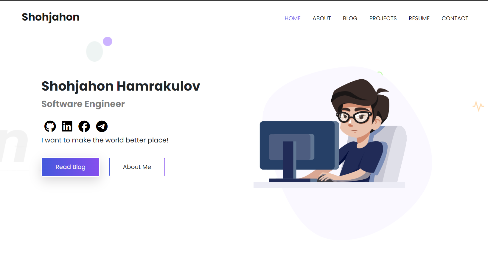
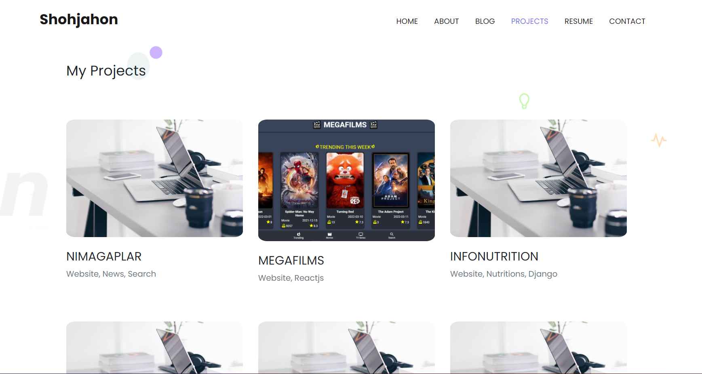

# My Personal Portfolio



### Language: python 3.9 +

### Frameworks : Django 4+

### Deployment: vercel, Bash

### Database : Sqlite


# About
My perconal portfolio website that I store my academic and portfolio information. Blogs, My CV, Projects




# Project Setup


# Architecture

```
.
└── app
    └── portfolio
        ├──  migrations
        ├──  __init__.py
        ├──  admin.py
        ├──  apps.py
        ├──  models.py
        ├──  api.py
        ├──  tests.py
        ├──  urls.py
        ├──  views.py
    └──  config
        ├──  __init__.py
        ├──  asgi.py
        ├──  urls.py
        ├──  settings.py
        ├──  wsgi.py
        
    ├── .gitignore
    ├── .gitlab-ci.yml
    ├──  manage.py
    ├──  requirements.txt
```

### models.py

```python
from core.base_model import BaseModel
from django.db import models


class MyModel(BaseModel):
    name = models.CharField(max_length=255)

    def __str__(self):
        return self.name
```

### views.py

## urls.py

```python
from django.urls import path

'from .views import MyView'

urlpatterns = [
    path("article/", views.article, name="article"),
]
```

### main.urls.py

```python
from django.urls import path, include

urlpatterns = [
    path('/api/v1/{app_name}/', include('{app_name.urls}'))
]
```
